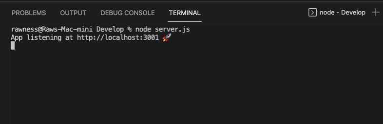

### About Note Taker

Click the GIF to watch a video demo of Note Taker:

Table of Contents

  <ol>
    <li><a href="#description">Description</a></li>
    <li><a href="#built-with">Built With</a></li>
    <li><a href="#installation">Installation</a></li>
    <li><a href="#usage">Usage</a></li>
    <li><a href="#future-updates">Future Updates</a></li>
  </ol>

## Description

Note Taker allows you to input a note title and text and save it to your local server.

## Built With

This application was built with Express, Bootstrap, JavaScript, CSS, and HTML. 

## Installation

Node.js installation is required. After cloning this repository, open server.js in your integrated terminal and run 'npm i'. 

## Usage

Open the folder containing server.js in your command line interface. From there, run the command 'node server.js'. Your command line console will display the port your local server is on.

Visit that port on your browser. I did that by putting 'localhost:3001' in my browser. Doing so brings you to the first page. Click get started to continue.

Any notes that are currently stored in db.json will be read and their note titles will show on the left size column. 

Typing in the 'Note Title' and 'Note Field' areas will toggle the save button in the top right. Once your note is ready to be posted, press the save icon and it will be stored in the db.json file. 

You will see its note title display on the left column. The 'Note Title' and 'Note Field' fields will clear and the save button will toggle off.

## Future Updates

<ul>
  <li>Working delete button</li>
  <li>Function that overwrites db.json with blank array if the file causes errors</li>
</ul>

